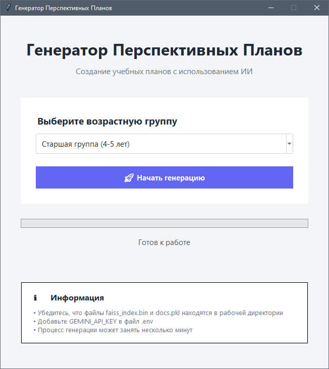

# AI-Генератор Перспективных Планов

## Обзор Проекта

В сфере дошкольного образования составление годовых перспективных планов — это фундаментальная, но чрезвычайно трудоемкая задача. Методисты и воспитатели вручную прорабатывают государственные стандарты, учебные программы и десятки методических пособий, тратя на это недели и месяцы человеческого труда.

**Этот проект решает данную проблему**, представляя собой автоматизированную систему для генерации таких планов. Используя мощь языковой модели **Google Gemini** и пайплайн **Retrieval-Augmented Generation (RAG)**, система способна создать **полноценный годовой план всего за 15-20 минут**.

Результат полностью соответствует нормативным требованиям, учитывает педагогическую прогрессию и основывается на предоставленной базе знаний, включающей госстандарты и лучшие методические практики.

## Ключевые Возможности

-   **Полная автоматизация:** Генерирует годовой план на 9 учебных месяцев (сентябрь-май) по нажатию одной кнопки.
-   **Высокая скорость:** Сокращает время планирования с нескольких недель до **менее чем получаса**.
-   **Педагогическая грамотность:** Работает на основе "Карты Учебного Года" (`curriculum_map.json`), которая обеспечивает логическую последовательность тем, их постепенное усложнение и закрепление пройденного материала.
-   **Гибкость и адаптивность:** Легко настраивается под разные возрастные группы (от младшей до предшкольной).
-   **Интеллектуальный поиск (RAG):** Использует векторную базу данных **FAISS** для поиска и применения наиболее релевантных методик из базы знаний для каждой конкретной задачи.
-   **Профессиональный результат:** Итоговый план сохраняется в виде отформатированного `.docx` документа, готового к печати и использованию.
-   **Дружелюбный GUI:** Простой интерфейс на **Tkinter** делает инструмент доступным для пользователей без технических навыков.

## Архитектура Проекта

Пайплайн состоит из трех основных этапов:

1.  **Дистилляция Знаний (`distiller.py`):** (Опционально) Исходные PDF-документы обрабатываются LLM для извлечения ключевой, конкретной информации и удаления "воды". На выходе получается набор очищенных `.txt` файлов.
2.  **Создание Индекса (`build_index.py`):** Очищенные текстовые документы разбиваются на чанки и векторизуются. Полученные эмбеддинги сохраняются в индекс FAISS для эффективного поиска по семантической близости.
3.  **Генерация Плана (`gui.py`):**
    *   Пользователь выбирает возрастную группу.
    *   Приложение загружает `curriculum_map.json` для получения тем на каждый месяц.
    *   Для каждой ячейки плана система извлекает из FAISS релевантный контекст (методические примеры).
    *   Этот контекст вместе с задачами из "Карты Учебного Года" передается в Google Gemini.
    *   Gemini генерирует контент, который очищается и вставляется в итоговый `.docx` документ.

## Как использовать

1.  **Клонируйте репозиторий:**
    ```bash
    git clone https://github.com/ваше-имя-пользователя/название-репозитория.git
    cd название-репозитория
    ```

2.  **Установите зависимости:**
    ```bash
    pip install -r requirements.txt
    ```

3.  **Настройте окружение:**
    *   Создайте файл `.env` в корневой директории.
    *   Добавьте в него ваш API-ключ от Google Gemini: `GEMINI_API_KEY="ВАШ_API_КЛЮЧ"`

4.  **Подготовьте Базу Знаний:**
    *   Поместите все ваши исходные `.pdf` или `.txt` документы в папку `pdfs`.
    *   (Опционально) Запустите дистиллятор для очистки исходных файлов:
        ```bash
        python distiller.py
        ```

5.  **Создайте Векторный Индекс:**
    *   Убедитесь, что `build_index.py` настроен на работу с вашей папкой с `.txt` файлами.
    *   Запустите скрипт:
        ```bash
        python build_index.py
        ```

6.  **Запустите приложение:**
    ```bash
    python gui.py
    ```
    Выберите возрастную группу и нажмите "Начать генерацию".

## Скриншоты

**Интерфейс приложения:**



**Пример сгенерированного документа:**


